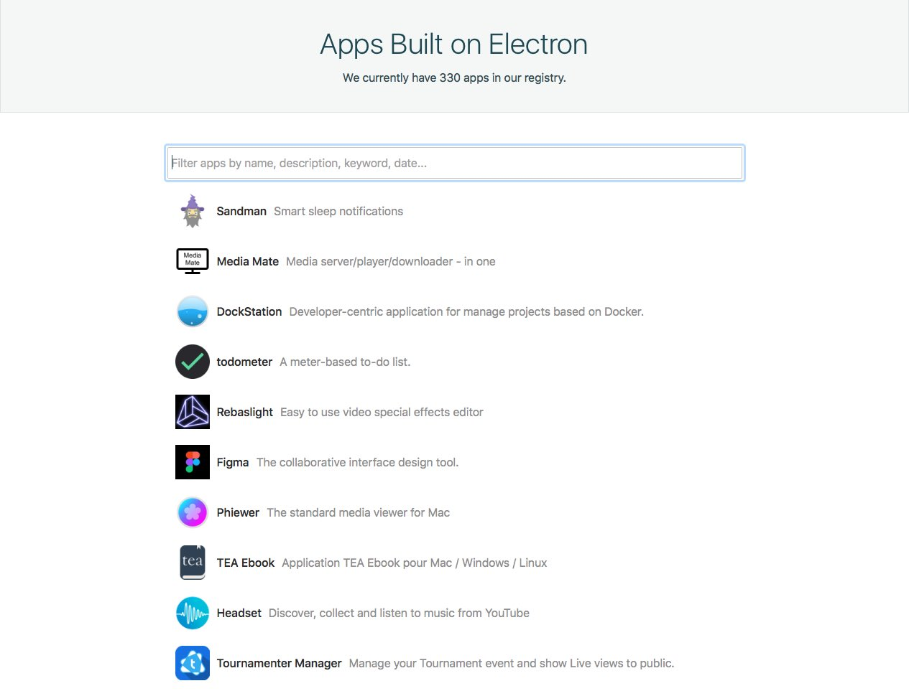

title: Electron Lightning Talk
author:
  name: Cory Reed
  twitter: swashcap
  github: swashcap
  url: http://swashcap.com
style: style.css
output: index.html

---

# Electron

---

## [History](https://electron.atom.io/docs/tutorial/about/#history)

Started as atom-shell – chromium to support GitHub's text editor Atom – in April 2013.

1. May 6, 2013: [issue opened](https://github.com/electron/electron/issues/1) for moving Atom to atom-shell
2. June 4, 2013: [Atom moved to atom-shell](https://github.com/atom/atom/pull/547)
3. April 17, 2015: [renamed Electron](https://github.com/electron/electron/pull/1389)

---

## Features

---

### Filesystem

Access to the filesystem: browse files on a user's computer, save files to disk, update files, etc.

---

### Other OS Integration

Easily integrate your application with the operating system

* Menus
* Notifications
* [System clipboard](https://electron.atom.io/docs/api/clipboard/)
* [Keyboard shortcuts](https://electron.atom.io/docs/tutorial/keyboard-shortcuts/)
* [Online/offline detection](https://electron.atom.io/docs/tutorial/online-offline-events/)
* [Multithreading](https://electron.atom.io/docs/tutorial/multithreading/) using WebWorkers
* [OS-specific features](https://electron.atom.io/docs/tutorial/desktop-environment-integration/) for richer experiences

---

### Debug

Use the familiar Chrome debugger and [DevTools extensions](https://electron.atom.io/docs/tutorial/devtools-extension/) to track down errors.

---

### Ship Updates

Built-in [`autoUpdater`](https://electron.atom.io/docs/api/auto-updater/) API a [Squirrel](https://github.com/Squirrel)-based server, like [electron-release-server](https://github.com/ArekSredzki/electron-release-server)

---

### JavaScript Ecosystem

The power of [npm](https://www.npmjs.com/), the largest package manager in the world

---

## Example Applications

---

### [Atom](https://atom.io/)

---

### [Slack](https://slack.com/downloads)

---

### [VS Code](https://code.visualstudio.com/)

---

### [WordPress’s desktop app](https://apps.wordpress.com/desktop/)

---

### [COINSTAC](https://github.com/MRN-Code/coinstac)

---

### [And more!](https://electron.atom.io/apps/)

---

## Developing With Electron

---

## Two Processes

A “main” process. A “render” process.

Couple options for cross-process communication:

* [`remote` API](https://electron.atom.io/docs/api/remote/)
* IPC [from main](https://electron.atom.io/docs/api/ipc-main/) and [from render](https://electron.atom.io/docs/api/ipc-renderer/)

---

### Native Modules

Native Node.js modules (like LevelDOWN, SQLite3, etc.) must be built for Electron.

---

### Debugging the Main Process

---

### Open Source

Maintainers are quick to respond to questions and issues.

---

### Testing

Easy UI testing with [Spectron](https://github.com/electron/spectron)

---

### Versioning

Stick to a specific version:

> Due to the hard dependency on Node.js and Chromium, Electron is in a tricky versioning position and [does not follow `semver`](http://semver.org/). You should therefore always reference a specific version of Electron.

– https://electron.atom.io/docs/tutorial/about/#versioning

The [release notes](https://electron.atom.io/releases/) are good notes, and thorough.

---

### DevTools Extensions

Load specific Chrome extensions into the Electron debugger: https://electron.atom.io/docs/tutorial/devtools-extension/

---

### Security!

Beware of vulnerabilities, mainly remote execution of malicious code: https://electron.atom.io/docs/tutorial/security/

---

## Demo

---

## Useful Links

* Main site: https://electron.atom.io
* Documentation: https://electron.atom.io/docs/
* Getting started guide: https://electron.atom.io/docs/tutorial/quick-start/
* Awesome Electron, a list of helpful tools for developing: https://github.com/sindresorhus/awesome-electron
* Simple sample applications:
  * Blog post: https://electron.atom.io/blog/2017/01/19/simple-samples
  * Repository: https://github.com/electron/simple-samples
* Twitter: https://twitter.com/electronjs
* API demos (which is an Electron application): https://github.com/electron/electron-api-demos
